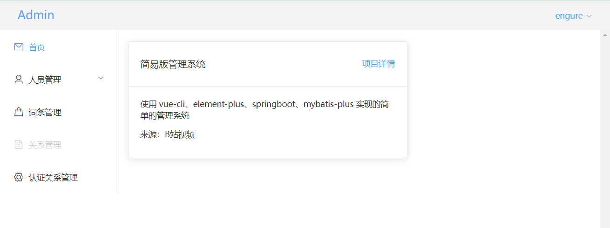
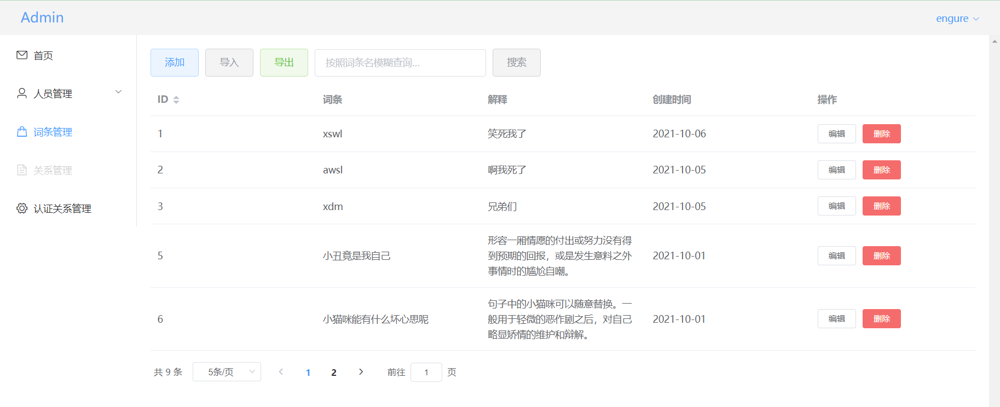

## 页面划分


分三部分：

1. 导航栏
2. 侧边栏

3. 主体区域


侧边栏高度占满屏幕

 


## 主体区域之用户操作


1. 操作：添加、模糊查询

2. 展示：表格，数据+操作
3. 分页：后台对应 Mybatis-Plus 分页
4. Axios 访问后端接口，使用 `vue.config.js` 配置代理


> 参考青戈老哥的这个文章：https://blog.csdn.net/xqnode/article/details/118325868


**前端接口前缀配置**

```js
const request = axios.create({
  timeout: 5000,
  baseURL: '/api' // 前端访问路径前缀，在 vue.config.js 中定义
})
```

配置后，前端在发请求时不用添加 `/api` 前缀了，接口和后端一样


**分页组件**

```vue
<div class="pagination-block">
  <el-pagination
    @size-change="handleSizeChange"				// 分页大小改变
    @current-change="handleCurrentChange"		// 页码改变
    :currentPage="currentPage"					// 当前页
    :page-sizes="pageSizes"						// 提供的分页大小，是一个整数数组
    :page-size="currentPageSize"				// 当前页码
    :page-count="pageCount"						// 当前页大小下，页面的总数量
    layout="total, sizes, prev, pager, next, jumper"
    :total="totalItemCount"						// 记录总数
  >
  </el-pagination>
```


### 路由配置


页面分类：

1. 登录 / 注册页
2. 管理页面（信息操作页，个人信息页等）


**App.vue 作为根节点**

```vue
<template>
  <div id="app">
    <!-- 根节点 -->
    <router-view/>
  </div>
</template>
```

**配置路由**

1. 登录注册页使用普通“单层”路由

2. 管理页使用==嵌套路由==

```js
const routes = [
  {
    path: '/',
    name: 'Layout',
    component: Layout,
    redirect: '/index',
    // 管理页的嵌套路由
    children: [
      {
        path: 'user',
        name: 'User',
        component: () => import('@/views/user/User')
      },
      {
        path: 'index',
        name: 'Index',
        component: () => import('@/views/Index')
      }
    ]
  },
  {
    path: '/login',
    name: 'Login',
    component: () => import('@/views/Login')
  }
]
```


## 登录注册退出

登陆注册页：

1. 单独页面

2. 表单校验（`:rules, ref, prop`）、自定义方法校验

退出功能：在按钮上绑定事件，路由切换，用户缓存清除


## 本地身份验证与存储


**将用户信息存放在 `sessionStorage` 中，相关方法：**

1. `getItem(key)`
2. `setItem(key, val)` 使用时将对象序列化成字符串存放在 val 中。
3. `clear`

> https://www.runoob.com/jsref/prop-win-sessionstorage.html
>
> `localStorage` 和 `sessionStorage` 属性允许在浏览器中存储 key/value 对的数据。
>
> `sessionStorage` **用于临时保存同一窗口(或标签页)的数据，在关闭窗口或标签页之后将会删除这些数据。**
>
> **提示:** 如果你想在浏览器窗口关闭后还保留数据，可以使用 [localStorage](https://www.runoob.com/jsref/prop-win-localstorage.html) 属性， 该数据对象没有过期时间，今天、下周、明年都能用，除非你手动去删除。


**Axios 拦截器所有请求，判断是否登录（sessionStorage 中是否有用户信息）**

```js
request.interceptors.request.use(
  config => {
      
      
    // 登陆验证
    if (sessionStorage.getItem('user') === null) {
      router.push('/login')
    }
      
    config.headers['Content-Type'] = 'application/json;charset=utf-8'
    return config
  },
  error => {
    return Promise.reject(error)
  })
```

危：可在控制台设置 sessionStorage！前端校验身份能力有限！


## 头部导航栏

加载时从 sessionStorage 取出用户信息进行渲染

```js
methods: {
  exitSys () {		// 退出系统，清除 sessionStorage
    this.$message({
      type: 'success',
      message: '退出成功'
    })
    sessionStorage.clear()
    this.$router.push('/login')
  }
},
created () {
  const userInfoStr = sessionStorage.getItem('user')
  if (userInfoStr == null) {
    this.$router.push('/login')		// 拿不到用户信息去登陆页
  } else {
    this.user = JSON.parse(userInfoStr)
  }
}
```


## 侧边栏导航

关于菜单栏：

1. `router` ：使用 index 属性导航
2. `unique-opened`：同时只打开一个子菜单
3. `default-active`：默认高亮的菜单项

```vue
<template>
    <div id="app">
    <h5>welcome</h5>
    <el-menu
        router
        unique-opened
        default-active="index"
        class="el-menu-vertical-demo">
        <el-menu-item index="index">
            <i class="el-icon-message"></i>
            <span>首页</span>
        </el-menu-item>
        <el-sub-menu index="people">
            <template #title>
                <i class="el-icon-user"></i>
                <span>人员管理</span>
            </template>
            <el-menu-item index="user">用户管理</el-menu-item>
            <el-menu-item index="store">库存管理</el-menu-item>
        </el-sub-menu>
        <el-menu-item index="financial">
            <i class="el-icon-goods"></i>
            <span>财务管理</span>
        </el-menu-item>
        <el-menu-item index="repo" disabled>
            <i class="el-icon-document"></i>
            <span>关系管理</span>
        </el-menu-item>
        <el-menu-item index="relation">
            <i class="el-icon-setting"></i>
            <span>认证关系管理</span>
        </el-menu-item>
    </el-menu>
    </div>
</template>
```


## 页面开发


新增词条页




```vue
<template>
  <div id="app">
      
    <!-- 操作区域 -->
    <div class="operation">
      <el-row>
        <el-button type="primary" @click="add" plain>添加</el-button>
        <el-button type="info" plain>导入</el-button>
        <el-button type="success" plain>导出</el-button>
        <el-input v-model="search" placeholder="按照词条名模糊查询..." clearable style="width: 250px; margin: auto 10px"/>
        <el-button type="info" @click="searchByName" plain>搜索</el-button>
      </el-row>
    </div>
      
    <!--表格-->
    <el-table :data="tableData" style="width: 100%">
        <el-table-column sortable prop="id" label="ID" />
        <el-table-column prop="name" label="词条"  />
        <el-table-column prop="des" label="解释"  />
        <el-table-column prop="createAt" label="创建时间"  />
        <el-table-column label="操作">
            <template #default="scope">
                <el-button size="mini" @click="handleEdit(scope.row)">编辑</el-button>
                <el-popconfirm title="确定删除吗？" @confirm="handleDel(scope.row.id)" icon="el-icon-info" icon-color="red">
                  <template #reference>
                      <el-button size="mini" type="danger">删除</el-button>
                  </template>
                </el-popconfirm>
            </template>
        </el-table-column>
    </el-table>

	<!-- 表格分页 -->
    <div class="pagination-block">
      <el-pagination
        @size-change="handleSizeChange"
        @current-change="handleCurrentChange"
        :currentPage="currentPage"
        :page-sizes="pageSizes"
        :page-size="currentPageSize"
        :page-count="pageCount"
        layout="total, sizes, prev, pager, next, jumper"
        :total="totalItemCount"
      >
      </el-pagination>
    </div>

	<!-- 对话框。添加和修改词条时使用 -->
    <el-dialog
      v-model="addDialogVisable"
      title="添加"
      width="30%">
      <el-form ref="form" :model="form" label-width="120px">
        <el-form-item label="词条名">
          <el-input v-model="form.name" style="width: 90%" placeholder=""></el-input>
        </el-form-item>
        <el-form-item label="解释">
          <el-input v-model="form.des" type="textarea" style="width: 90%" placeholder=""></el-input>
        </el-form-item>
        <el-form-item label="创建时间">
          <el-date-picker type="date" format="YYYY-MM-DD" clearable v-model="form.createAt"></el-date-picker>
        </el-form-item>
      </el-form>

      <template #footer>
        <span class="dialog-footer">
          <el-button @click="addDialogVisable = false">取消</el-button>
          <el-button type="primary" @click="doAdd" >添加</el-button>
        </span>
      </template>
    </el-dialog>

  </div>
</template>

<script>
import request from '@/util/request'
export default {
  data () {
    return {
      form: {},
      addDialogVisable: false,
      pageSizes: [5, 10, 20],
      currentPage: 1,
      currentPageSize: 10,
      totalItemCount: 0,
      pageCount: 1,
      search: '',
      tableData: []
    }
  },
  created: function () {
    this.load()
  },
  methods: {
      
    // 分页加载数据
    load () {
      request.get('/word', {
        params: {
          pageNum: this.pageNum,
          pageSize: this.pageSize,
          search: this.search
        }
      }).then(res => {
        console.log(res)
        if (res.code === 200) {
          this.tableData = res.data.records
          this.totalItemCount = res.data.total
          this.pageSize = res.data.size
          this.currentPage = res.data.current
          this.pageCount = res.data.pages
        } else {
          this.$message({
            type: 'error',
            message: '出错了'
          })
        }
      }).catch(res => {
        // 后端未开启
        this.$message({
          type: 'error',
          message: '网络错误'
        })
      })
    },
      
    // 编辑某一行
    handleEdit (row) {
      // 深拷贝，拷贝自表格中的数据
      this.form = JSON.parse(JSON.stringify(row))
      this.addDialogVisable = true
    },
    
    // 搜索
    searchByName () {
      this.load()
    },
      
    // 点击添加弹窗
    add () { // 打开添加弹框
      this.addDialogVisable = true
      this.form = { }
    },
    
    // 修改或添加数据
    doAdd () {
      // 修改
      if (this.form.id) {
        request.put('/word', {
          id: this.form.id,
          name: this.form.name,
          des: this.form.des,
          createAt: this.form.createAt
        })
          .then(res => {
            this.$message({
              type: 'success',
              message: res.msg
            })
            this.load()
          })
          .catch(res => {
            this.$message({
              type: 'error',
              message: '出错了'
            })
          })
      } else {
        // 添加
        request.post('/word', {
          name: this.form.name,
          des: this.form.des,
          createAt: this.form.createAt
        })
          .then(res => {
            this.$message({
              type: 'success',
              message: res.msg
            })
            this.load()
          })
          .catch(res => {
            this.$message({
              type: 'error',
              message: '出错了'
            })
          })
      }
      this.addDialogVisable = false
    },
      
    // 删除数据
    handleDel (id) {
      request.delete('/word/' + id).then(res => {
        this.$message({
          type: 'success',
          message: res.msg
        })
        this.load()
      }).catch(res => {
        this.$message({
          type: 'error',
          message: '出错了~~~'
        })
      })
    },
      
    // 分页组件事件
    handleSizeChange (pageSize) { // 改变分页大小
      this.pageSize = pageSize
      this.load()
    },
    handleCurrentChange (pageNum) { // 改变页码
      this.pageNum = pageNum
      this.load()
    }
  }
}
</script>
```


