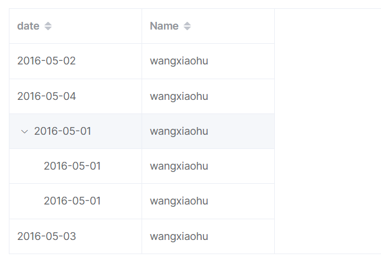

## 文件上传下载


**后端文件上传下载接口**


**前端图片上传和展示**

表格中的图片展示

```vue
<el-table-column label="头像">
    <template #default="scope">
		<el-image
          style="width: 100px; height: 100px"
          :src="scope.row.url"
          :preview-src-list="[scope.row.url]">			可放置多个图片的url
        </el-image>
    </template>
</el-table-column>
```

表单中上传头像

```vue
<el-form-item label="上传头像">
  <el-upload
    ref="upload"
    :action="filesUploadUrl"
    :on-success="filesUploadSuccess">
    <el-button size="small" type="primary">Click to upload</el-button>
  </el-upload>
</el-form-item>
```


注意：

**1. 在每次添加时清除上传组件中上次上传的文件**

```js
if (this.$refs['upload']) {	// 组件的 ref 属性找到组件
    this.$refs['upload'].clearFiles() // 清除历史文件列表
}
```

**2. 编辑时的图片重传**

```js
this.$nextTick(() => {
  if (this.$refs['upload']) {
    this.$refs['upload'].clearFiles()  // 清除历史文件列表
  }
})
```

关于 `vue.nextTick()` https://blog.csdn.net/zhouzuoluo/article/details/84752280

**将回调函数延迟在下一次dom更新数据后调用**，简单的理解是：**当数据更新了，在dom中渲染后，自动执行该函数**


- https://www.cnblogs.com/lixianguo/p/12518970.html

- https://gitee.com/engureguo/springboot-vue-demo/blob/master/springboot/src/main/java/com/example/demo/controller/FileController.java


## 富文本编辑框

wang编辑器 https://www.wangeditor.com/

`v-html="form.content"`

文本的获取与渲染


## 数据权限控制


`v-if="权限判断逻辑"`

前端的逻辑判断是不安全的，需要做后端逻辑判断


### 验证码防刷

青戈在前端实现，不安全。

做法：后端接口，返回 token 和 base64 图片，Redis 存放`token —— 验证码值`，1min 超时时间


## 一对多查询

> 之前的都是单表查询，若要一对多查询，需要编写 mapper#method
>
> 自定义 mapper#method 使用分页：https://mp.baomidou.com/guide/interceptor-pagination.html#paginationinnerinterceptor


```java
class User {
    
    private Integer id;
    private String username;
    // ...
    
    @TableField(exists = false)	// 告诉mybatis-plus该字段不存在表中
    private ArrayList<Book> bookList;
}
```


### 批量删除

 

多选框：https://element-plus.gitee.io/zh-CN/component/table.html#multiple-select

Mapper 接口：https://mp.baomidou.com/guide/crud-interface.html#delete

```java
// 删除（根据ID 批量删除）
int deleteBatchIds(@Param(Constants.COLLECTION) Collection<? extends Serializable> idList);
```


### 树形表

 

```js
// 数据格式要求
[
    {
        id: 1,
        date: '2016-05-02',
        name: 'wangxiaohu',
    },
    {
        id: 2,
        date: '2016-05-04',
        name: 'wangxiaohu',
    },
    {
        id: 3,
        date: '2016-05-01',
        name: 'wangxiaohu',
        children: [
            {
                id: 31,
                date: '2016-05-01',
                name: 'wangxiaohu',
            },
            {
                id: 32,
                date: '2016-05-01',
                name: 'wangxiaohu',
            },
        ],
    },
    {
        id: 4,
        date: '2016-05-03',
        name: 'wangxiaohu',
    },
]
```

树形数据与懒加载：https://element-plus.gitee.io/zh-CN/component/table.html#%E6%A0%91%E5%BD%A2%E6%95%B0%E6%8D%AE%E4%B8%8E%E6%87%92%E5%8A%A0%E8%BD%BD


